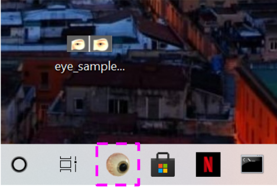
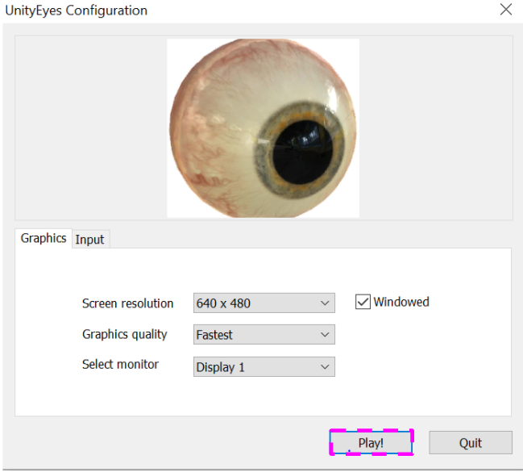
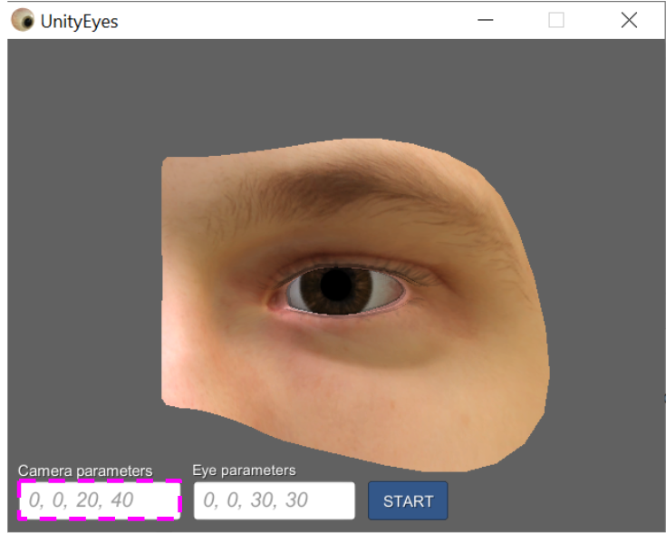

# DeepMetis: UnityEyes

## General Information ##
This folder contains the application of the DeepMetis approach to the eye gaze prediction problem.
This tool is developed in Python on top of the DEAP evolutionary computation framework. It has been tested on a Windows machine equipped with a i9 processor, 32 GB of memory, and an Nvidia GPU GeForce RTX 2080 Ti with 11GB of dedicated memory.

## Step 1: Configure the environment ##

This tool needs the UnityEyes and Sikuli to be installed on the machine where it is running. 

### Step 1.1: Java Installation ###

Download and install [Java SE 11](https://www.oracle.com/it/java/technologies/javase-jdk11-downloads.html). Official instructions [here].(https://docs.oracle.com/en/java/javase/11/install/installation-jdk-microsoft-windows-platforms.html#GUID-C11500A9-252C-46FE-BB17-FC5A9528EAEB)

### Step 1.2: Python Installation ###

Install [_Python 3.7.9_](https://www.python.org/ftp/python/3.7.9/python-3.7.9-amd64.exe)

To easily install the dependencies with pip, we suggest to create a dedicated virtual environment. For example, you can use `venv` and create a virtual environment called `.venv` inside the current folder (`DeepHyperion-BNG`):

```
python -m venv .venv
```

At this point, you need to activate the virtual environment, and check that you are using the correct version of python.

``` 
.\.venv\Scripts\activate

py.exe -V
```
This command should produce as output the following string: `Python 3.7.9`

> **NOTE**: The command is `py.exe` not `python.exe`

At this point, upgrade `pip`, and install the required packages:

```
py.exe -m pip install --upgrade pip

pip install setuptools --upgrade

pip install -r requirements.txt
```


### Step 1.3: UnityEyes Installation and Configuration ###

* Download a free version of UnityEyes from the [official website](https://www.cl.cam.ac.uk/research/rainbow/projects/unityeyes/data/UnityEyes_Windows.zip).  
* Edit the UNITYEYES_PATH in [properties.py](properties.py) by inserting the path to your UnityEyes folder. 
* Pin the UnityEyes application to the taskbar: [instructions here](https://support.microsoft.com/en-us/windows/pin-apps-and-folders-to-the-desktop-or-taskbar-f3c749fb-e298-4cf1-adda-7fd635df6bb0)

### Step 1.4: SikuliX Installation and Configuration ###

The folder Sikuli-jars contains a version of SikuliX downloaded from the [official website](http://sikulix.com). We use it to allow the interaction of DeepMetis with UnityEyes via GUI. Therefore, for each system the user should provide a screenshot of the GUI widgets to interact with. In the following, we will provide instructions on how to capture these images. To this aim, we provide the whole window along with the specific widget to crop, i.e. the one highlighted with a pink frame.

* In the taskbar, take a screenshot of the highlighted component (i.e., UnityEyes icon) and save it as eye.png



* Start UnityEyes and from the starting window take a screenshot of the highlighted component (i.e., play button) and save it as play.png



* Press the play button and from the main window take a screenshot of the highlighted component (i.e., first edit text widget) and save it as first.png



* From the UnityEyes' main window take a screenshot of the highlighted component (i.e., second edit text widget) and save it as second.png


* From the UnityEyes' main window take a screenshot of the highlighted component (i.e., start button) and save it as start.png


* From the UnityEyes' main window take a screenshot of the highlighted component (i.e., close window button) and save it as x.png


* Finally, save all the captured images in the [sikulix_scripts/unityeyes.sikuli folder](sikulix_scripts/unityeyes.sikuli/)

> **NOTE**: We already provided examples of these images in the [sikulix_scripts/unityeyes.sikuli folder](sikulix_scripts/unityeyes.sikuli/) but you must replace them to match your own screen resolution.

## Step 2: Run DeepMetis

Use the following commands to start a run of DeepMetis-UE:

```
python test.py
python main.py
```

> NOTE: The user must not interact with the pc during the run

When the run ends, on the console you should see a message like the following:

```
Final solution N is: X
GAME OVER

Process finished with exit code 0
```

where X is the number of generated mutant-killing inputs.

Moreover, DeepMetis will create a folder `results` which contains: 
* the archive of solutions (`archive` folder); 
* the final report (`report_final.json`);
* the configuration's description (`config.json`).

## Step 3: Evaluate the Mutation Score with DeepCrime ##
