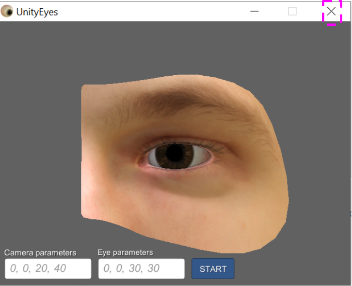

# DeepMetis: UnityEyes

## General Information ##
This folder contains the application of the DeepMetis approach to the eye gaze prediction problem.
This tool is developed in Python on top of the DEAP evolutionary computation framework. It has been tested on a Windows machine equipped with a i9 processor, 32 GB of memory, and an Nvidia GPU GeForce RTX 2080 Ti with 11GB of dedicated memory.

## Step 1: Configure the environment ##

This tool needs the UnityEyes and Sikuli to be installed on the machine where it is running. 

### Step 1.1: Java Installation ###

### Step 1.2: Python Installation ###

### Step 1.3: UnityEyes Installation and Configuration ###

* Download a free version of UnityEyes from the [official website](https://www.cl.cam.ac.uk/research/rainbow/projects/unityeyes/data/UnityEyes_Windows.zip).  
* Edit the UNITYEYES_PATH in [properties.py](properties.py) by inserting the path to your UnityEyes folder. 
* Pin the UnityEyes application to the taskbar: [instructions here](https://support.microsoft.com/en-us/windows/pin-apps-and-folders-to-the-desktop-or-taskbar-f3c749fb-e298-4cf1-adda-7fd635df6bb0)

### Step 1.4: SikuliX Installation and Configuration ###

The folder Sikuli-jars contains a version of SikuliX downloaded from the [official website](http://sikulix.com). We use it to allow the interaction of DeepMetis with UnityEyes via GUI. Therefore, for each system the user should provide a screenshot of the GUI widgets to interact with.  




### Step 1.5: Other Dependencies ###

To easily install the dependencies with pip, we suggest to create a dedicated virtual environment and run the command:

```pip install -r requirements.txt```

## Step 2: Run DeepMetis

Use the following commands to start a run of DeepMetis-UE:

```
python test.py
python main.py
```

> NOTE: The user must not interact with the pc during the run

When the run ends, on the console you should see a message like the following:

```
Final solution N is: X
GAME OVER

Process finished with exit code 0
```

where X is the number of generated mutant-killing inputs.

Moreover, DeepMetis will create a folder `results` which contains: 
* the archive of solutions (`archive` folder); 
* the final report (`report_final.json`);
* the configuration's description (`config.json`).

## Step 3: Evaluate the Mutation Score with DeepCrime ##
